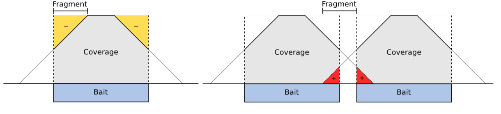

# Day 2

# A. Structure of larger variant calling – CNV pipeline
 
Introductory notes about copy number mutations and theoretical background can be found [here](https://github.com/BiodataAnalysisGroup/IMGGE-WES-WGS-data-analysis-workshop/blob/main/day%202/CNV.pdf).
      
      
  ## CNVkit: Genome-wide copy number from high-throughput sequencing 
 ### About the library  
  CNVkit is a Python library and command-line software toolkit to infer and visualize copy number from high-throughput DNA sequencing data.
  For more information have a look at both the [documentaion](https://cnvkit.readthedocs.io/en/stable/) and the corresponding [publication](https://doi.org/10.1371/journal.pcbi.1004873) .
  
  
 ### Command Info
 
- Copy number calling pipeline

`guess_baits.py`: Use the read depths in one or more given BAM files to infer which regions were targeted. This script can be used in case the original BED file of targeted intervals is unavailable. 

`target`: Prepare a BED file of baited regions for use with CNVkit. Since these regions (usually exons) may be of unequal size, the `--split` option divides the larger regions so that the average bin size after dividing is close to the size specified by `--average-size`. The `--annotate` option can add or replace these labels. Gene annotation databases, e.g. RefSeq or Ensembl, are available in “flat” format from UCSC (e.g. [useful_files/refFlat.txt](https://github.com/BiodataAnalysisGroup/IMGGE-WES-WGS-data-analysis-workshop/blob/main/day%202/useful_files/refFlat.txt)).

Exons in the human genome have an average size of about 200bp. The target bin size default of 267 is chosen so that splitting larger exons will produce bins with a minimum size of 200. Since bins that contain fewer reads result in a noisier copy number signal, this approach ensures the “noisiness” of the bins produced by splitting larger exons will be no worse than average.

`access`: Calculate the sequence-accessible coordinates in chromosomes from the given reference genome, output as a BED file. Many fully sequenced genomes, including the human genome, contain large regions of DNA that are inaccessable to sequencing. (These are mainly the centromeres, telomeres, and highly repetitive regions.) In the reference genome sequence these regions are filled in with large stretches of “N” characters. These regions cannot be mapped by resequencing, so CNVkit avoids them when calculating the antitarget bin locations. This command computes the locations of the accessible sequence regions for a given reference genome based on these masked-out sequences, treating long spans of ‘N’ characters as the inaccessible regions and outputting the coordinates of the regions between them.

An “access” file precomputed for the UCSC reference human genome build hg19, with some known low-mappability regions excluded, is included in the directory ([useful_files/access-5kb-mappable.hg19_chr5_chr12_chr17.bed](https://github.com/BiodataAnalysisGroup/IMGGE-WES-WGS-data-analysis-workshop/blob/main/day%202/useful_files/access-5kb-mappable.hg19_chr5_chr12_chr17.bed)).

`antitarget`: Given a “target” BED file that lists the chromosomal coordinates of the tiled regions used for targeted resequencing, derive a BED file off-target/”antitarget” regions. Certain genomic regions cannot be mapped by short-read resequencing (see access); we can avoid them when calculating the antitarget locations by passing the locations of the accessible sequence regions with the `-g` or `--access` option. CNVkit will then compute “antitarget” bins only within the accessible genomic regions specified in the “access” file.

Each contiguous off-target region is divided into equal-sized bins such that the average bin size within the region is as close as possible to the size specified by the user. The user can select an appropriate off-target bin size by calculating the product of the average target region size and the fold-enrichment of sequencing reads in targeted regions, such that roughly the same number of reads are mapped to on– and off-target bins on average. In an effort to maximize the number of bins, CNVkit will deviate from the user-specified bin size to fit bins into small regions, such as introns, that are restricted in size. 

`autobin`: Quickly estimate read counts or depths in a BAM file to estimate reasonable on- and (if relevant) off-target bin sizes. If multiple BAMs are given, use the BAM with median file size.

Generates target and (if relevant) antitarget BED files, and prints a table of estimated average read depths and recommended bin sizes on standard output.

`coverage`: computes the log2 mean read depth in each bin for a sample using an alignment of sequencing reads in BAM format and the positions of the on– or off-target bins in BED or interval list format. For each bin the read depths at each base pair in the bin are calculated and summed and then divided by the size of the bin. The output is a table of the average read depths in each of the given bins log2-transformed and centered to the median read depth of all autosomes.

`reference`:  estimates the expected read depth of each on– and off-target bin across a panel of control or comparison samples to produce a reference copy-number profile that can then be used to correct other test samples. At each genomic bin, the read depths in each of the given control samples are extracted. Read-depth bias corrections are performed on each of the control samples. 

In each bin, i) a *weighted average of the log2 read depths* among the control samples is calculated to indicate bins that systematically have higher or lower coverage, and ii) the *spread or statistical dispersion of log2 read depths* indicates bins that have erratic coverage so that they can be de-emphasized at the segmentation step. A single paired control sample can also be used, or, in absence of any control samples, a “generic” reference can be constructed with a log2 read depth and spread of 0 assigned to all bins.




Additional information can be associated with each bin for later use in bias correction and segmentation. If the user provides a FASTA file of the reference genome at this step, the GC content and repeat-masked fraction of each binned corresponding genomic region are calculated. CNVkit calculates the fraction of each bin that is masked and records this fraction in an additional column in the reference file, along with GC, average log2 read depth, and spread.

`fix`: combines a single sample’s on– and off-target binned read depths, removes bins failing predefined criteria, corrects for systematic biases in bin coverage (see below), subtracts the reference log2 read depths, and finally median-centers the corrected copy ratios.

Each bin is then assigned a weight to be used in segmentation and plotting. Each bin’s weight is calculated according to i) bin size, ii)difference from the global median coverage (if at least one control sample is provided), and iii) the spread of normalized coverages in the control pool (if more than one control sample is provided). Finally, the overall variability of bin log2 ratio values is compared between on- and off-target bins, and the more variable of the two sets is downweighted in proportion.

- Correction of coverage biases:

  - Genomic GC content: DNA regions with extreme GC content are less accessible to hybridization and amenable to amplification during library preparation. The degree of GC bias can vary between samples due to differences such as the quality of each sample’s DNA or efficiency of hybridization between library preparations. To remove this bias, CNVkit applies a rolling median correction (see below) to GC values on both the target and off-target bins, independently.

  -  Sequence repeats: Repetitive sequences in the genome can complicate read-depth calculations, as these regions often show high variability in coverage from sample to sample. This variability may be due to differences in the efficiency of the blocking step during library preparation. The presence of sequence repeats serves as an indicator for regions prone to these biases.

  - Target density: i) The “shoulders” of each interval showed reduced read depth due to incomplete sequence match to the bait, creating a negative bias in the observed read depth inside the interval near each edge and ii) in the “flanks” of the baited interval due to the same mechanism, where targets are closely spaced or adjacent, the flanking read depth may overlap with a neighboring target, creating a positive bias in its observed read depth.

  While the density bias can be significantly reduced by normalizing each sample to a reference, it may vary between samples due to differences in the insert sizes of    sequence fragments introduced during the step of DNA fragmentation of the library preparation, and thus should still be accounted for even if a matched normal          comparison exists. Density bias being related to the capture, CNVkit only applies this correction to the on-target bins.

  All of the information needed to calculate the biases at each bin is stored in the reference file. For each of the biases (GC content, repeat-masked fraction, target   density), the bias value is calculated for each bin. Next, bins are sorted by bias value. A rolling median is then calculated across the bin log2 ratios ordered by     bias value to obtain a midpoint log2 ratio value representing the expected bias for each bin. Finally, this value is subtracted from the original bin log2 ratio for   the given sample to offset the observed bias. 
  
  
`segment`: sample’s corrected bin-level copy ratio estimates can be segmented into discrete copy-number regions. The bin log2 ratio values are first optionally filtered for outliers, defined as a fixed multiple of the 95th quartile in a rolling window. The default segmentation algorithm used is circular binary segmentation (CBS). Infer discrete copy number segments from the given coverage table. 

If a VCF file is given with the `--vcf` option, then after segmenting log2 ratios, a second pass of segmentation will run within each log2-ratio-based segment on the SNP allele frequencies loaded from the VCF.

`call`: rounds the log2 ratios to the nearest integer absolute copy number given the normal ploidy of each chromosome, or directly maps segment log2 ratios to absolute copy number states given a set of numeric thresholds.

- Plots and graphics

`scatter`: Plot bin-level log2 coverages and segmentation calls together. Without any further arguments, this plots the genome-wide copy number in a form familiar to those who have used array CGH. The options `--chromosome` and `--gene` focus the plot on the specified region; the genes in the specified region or with the specified names will be highlighted and labeled in the plot. 

The allelic frequencies of heterozygous SNPs can be viewed alongside copy number by passing variants as a VCF file with the `-v` option. These allele frequences are rendered in a subplot below the CNV scatter plot.

`diagram`: Draw copy number (either individual bins (.cnn, .cnr) or segments (.cns)) on chromosomes as an ideogram. If both the bin-level log2 ratios and segmentation calls are given, show them side-by-side on each chromosome (segments on the left side, bins on the right side).

`heatmap`: Draw copy number (either bins (.cnn, .cnr) or segments (.cns)) for multiple samples as a heatmap.

- Text and tabular reports

`breaks`: List the targeted genes in which a segmentation breakpoint occurs. This helps to identify genes in which (a) an unbalanced fusion or other structural rearrangement breakpoint occured, or (b) CNV calling is simply difficult due to an inconsistent copy number signal.

`genemetrics`: Identify targeted genes with copy number gain or loss above or below a threshold. The first four columns of output table show each targeted gene’s name and its genomic coordinates (based on the first and last bins with that label in the original target BED file, and thus the .cnr file). With segments (-s):

  - *log2*: The log2 ratio value of the segment covering the gene, i.e. weighted mean of all bins covered by the whole segment, not just this gene.
  - *depth*,*weight*, *probes*: As above.
  - *seg_weight*: The sum of the weights of the bins supporting the segment.
  - *seg_probes*: The number of probes supporting the segment.


### BAM files
  
 The BAM files that are used throughout this tutorial are processed following the pipeline from this [Galaxy Training Tutorial](https://training.galaxyproject.org/training-material/topics/variant-analysis/tutorials/somatic-variants/tutorial.html).

  ### Pipeline
  
 All of the above commands assembled in the following pipeline, which has both a user defined  and an automated version through `batch` command.
 
 ```bash
#create baits.bed
#uses .bed file and caverage from .bam to infer the targeted regions 
guess_baits.py Tumor.bam -t gene_targets.bed -o baits.bed

#devides larger bins to smaller
cnvkit.py target baits.bed  --split --annotate refFlat.txt -o baits_target.bed

#run antitarget
cnvkit.py antitarget gene_targets.bed -g access-5kb-mappable.hg19_chr5_chr12_chr17.bed -o my_antitargets.bed

#calculate coverage in the target/antitarget regions from BAM read depths
cnvkit.py coverage Tumor.bam baits_target.bed -o Tumor.targetcoverage.cnn
cnvkit.py coverage Tumor.bam my_antitargets.bed -o Tumor.antitargetcoverage.cnn

cnvkit.py coverage Normal.bam baits_target.bed -o Normal.targetcoverage.cnn
cnvkit.py coverage Normal.bam my_antitargets.bed -o Normal.antitargetcoverage.cnn

#copy number reference from Normal.bam
cnvkit.py reference *Normal.{,anti}targetcoverage.cnn --fasta reference.fasta -o my_reference.cnn

#combine the uncorrected target and antitarget coverage tables (.cnn) and correct for biases
cnvkit.py fix Tumor.targetcoverage.cnn Tumor.antitargetcoverage.cnn my_reference.cnn -o Tumor.cnr
cnvkit.py fix Normal.targetcoverage.cnn Normal.antitargetcoverage.cnn my_reference.cnn -o Normal.cnr

#infer discrete copy number segments from the given coverage table
cnvkit.py segment Tumor.cnr -o Tumor.cns

#given segmented log2 ratio estimates (.cns), derive each segment’s absolute integer copy number
cnvkit.py call Tumor.cns -o Tumor.call.cns -v VarScan_somatic.vcf

#plot bin-level log2 coverages and segmentation calls together
cnvkit.py scatter Tumor.cnr -s Tumor.cns  -v VarScan_somatic.vcf -o Tumor-scatter.pdf

# Draw copy number on chromosomes as an ideogram 
cnvkit.py diagram -s Tumor.cns Tumor.cnr

#we can try genemetrics both with and without the segment files, 
#take the intersection of those as a list of “trusted” genes, and visualize each of them
cnvkit.py genemetrics -y Tumor.cnr -s Tumor.cns | tail -n+2 | cut -f1 | sort > segment-genes.txt
cnvkit.py genemetrics -y Tumor.cnr | tail -n+2 | cut -f1 | sort > ratio-genes.txt
comm -12 ratio-genes.txt segment-genes.txt > trusted-genes.txt
mkdir gene_scatter_plots

for gene in `cat trusted-genes.txt`
do
    cnvkit.py scatter -s Tumor.cn{s,r} -g $gene -o gene_scatter_plots/Tumor-$gene-scatter.pdf
done

``` 
# B. From variants to Genome-Wide Association Studies

In this part of the tutorial we discuss and provide practical examples on how to perform a Genome-Wide Association study (GWAS) from variants (a single VCF file), produced following steps similar to the example we went over in day 1:

1. Quality control and trimming of raw FASTQ data
2. Mapping to a reference genome
3. SAM/BAM file pre-processing
4. Variant calling (e.g., with FreeBayes)
5. VCF file pre-processing (e.g., filtering and merging with bcftools)
6. VCF file annotation (e.g., with SnpEff and SnpSift)

The GWAS analysis here is performed using [PLINK 1.9](https://www.cog-genomics.org/plink/) (DOI:[10.1186/s13742-015-0047-8](https://doi.org/10.1186/s13742-015-0047-8)) and follows the published tutorial of **Marees et al. 2018** (https://github.com/MareesAT/GWA_tutorial/) (DOI:[10.1002/mpr.1608](https://doi.org/10.1002/mpr.1608)) with minor changes.

PLINK accepts two types of input data:

1. Text PLINK data that consist of two files: one contains information on the individuals and their genotypes (\*.ped); the other contains information on the genetic markers (\*.map).
2. Binary PLINK data that consist of three files: a binary file that contains individual identifiers (IDs) and genotypes (\*.bed), and two text files that contain information on the individuals (\*.fam) and on the genetic markers (\*.bim).

## B.1 - Quality Control before GWAS analysis

### Step B.1.1 - Missingness of SNPs and individuals

```bash
# Change directory to a folder on your UNIX device containing all files from 1_QC_GWAS.zip:
# cd <path-to-downloaded-material>/1_QC_GWAS

# Investigate missingness per individual and per SNP and make histograms.
plink --bfile HapMap_3_r3_1 --missing
# output: plink.imiss and plink.lmiss, these files show respectively the proportion of missing SNPs per individual and the proportion of missing individuals per SNP.

# Generate plots to visualize the missingness results.
Rscript --vanilla hist_miss.R

# Delete SNPs and individuals with high levels of missingness, explanation of this and all following steps can be found in box 1 and table 1 of the article mentioned in the comments of this script.
# The following two QC commands will not remove any SNPs or individuals. However, it is good practice to start the QC with these non-stringent thresholds.  
# Delete SNPs with missingness >0.2.
plink --bfile HapMap_3_r3_1 --geno 0.2 --make-bed --out HapMap_3_r3_2

# Delete individuals with missingness >0.2.
plink --bfile HapMap_3_r3_2 --mind 0.2 --make-bed --out HapMap_3_r3_3

# Delete SNPs with missingness >0.02.
plink --bfile HapMap_3_r3_3 --geno 0.02 --make-bed --out HapMap_3_r3_4

# Delete individuals with missingness >0.02.
plink --bfile HapMap_3_r3_4 --mind 0.02 --make-bed --out HapMap_3_r3_5

###################################################################
```
### Step B.1.2 - Sex discrepancy

```bash
### Step2 ####

# Check for sex discrepancy.
# Subjects who were a priori determined as females must have a F value of <0.2, and subjects who were a priori determined as males must have a F value >0.8. This F value is based on the X chromosome inbreeding (homozygosity) estimate.
# Subjects who do not fulfil these requirements are flagged "PROBLEM" by PLINK.
plink --bfile HapMap_3_r3_5 --check-sex 

# Generate plots to visualize the sex-check results.
Rscript --vanilla gender_check.R
# These checks indicate that there is one woman with a sex discrepancy, F value of 0.99. (When using other datasets often a few discrepancies will be found). 

# The following two scripts can be used to deal with individuals with a sex discrepancy.
# Note, please use one of the two options below to generate the bfile hapmap_r23a_6, this file we will use in the next step of this tutorial.

# 1) Delete individuals with sex discrepancy.
grep "PROBLEM" plink.sexcheck | awk '{print$1,$2}'> sex_discrepancy.txt
# This command generates a list of individuals with the status PROBLEM.
plink --bfile HapMap_3_r3_5 --remove sex_discrepancy.txt --make-bed --out HapMap_3_r3_6 
# This command removes the list of individuals with the status PROBLEM.

# 2) impute-sex.
#plink --bfile HapMap_3_r3_5 --impute-sex --make-bed --out HapMap_3_r3_6
# This imputes the sex based on the genotype information into your data set.

###################################################
```
### Step B.1.3 - Minor allele frequency (MAF)

```bash
### Step 3 ### 

# Generate a bfile with autosomal SNPs only and delete SNPs with a low minor allele frequency (MAF).

# Select autosomal SNPs only (i.e., from chromosomes 1 to 22).
awk '{ if ($1 >= 1 && $1 <= 22) print $2 }' HapMap_3_r3_6.bim > snp_1_22.txt
plink --bfile HapMap_3_r3_6 --extract snp_1_22.txt --make-bed --out HapMap_3_r3_7

# Generate a plot of the MAF distribution.
plink --bfile HapMap_3_r3_7 --freq --out MAF_check
Rscript --vanilla MAF_check.R

# Remove SNPs with a low MAF frequency.
plink --bfile HapMap_3_r3_7 --maf 0.05 --make-bed --out HapMap_3_r3_8
# 1073226 SNPs are left
# A conventional MAF threshold for a regular GWAS is between 0.01 or 0.05, depending on sample size.

####################################################
```
### Step B.1.4 - Hardy-Weinberg equilibrium (HWE)

```bash
# Delete SNPs which are not in Hardy-Weinberg equilibrium (HWE).
# Check the distribution of HWE p-values of all SNPs.

plink --bfile HapMap_3_r3_8 --hardy
# Selecting SNPs with HWE p-value below 0.00001, required for one of the two plot generated by the next Rscript, allows to zoom in on strongly deviating SNPs. 
awk '{ if ($9 <0.00001) print $0 }' plink.hwe > plinkzoomhwe.hwe
Rscript --vanilla hwe.R

# By default the --hwe option in plink only filters for controls.
# Therefore, we use two steps, first we use a stringent HWE threshold for controls, followed by a less stringent threshold for the case data.
plink --bfile HapMap_3_r3_8 --hwe 1e-6 --make-bed --out HapMap_hwe_filter_step1

# The HWE threshold for the cases filters out only SNPs which deviate extremely from HWE. 
# This second HWE step only focusses on cases because in the controls all SNPs with a HWE p-value < hwe 1e-6 were already removed
plink --bfile HapMap_hwe_filter_step1 --hwe 1e-10 --hwe-all --make-bed --out HapMap_3_r3_9

# Theoretical background for this step is given in our accompanying article: https://www.ncbi.nlm.nih.gov/pubmed/29484742 .

############################################################
```
### Step B.1.5 - Heterozygosity

```bash
# Generate a plot of the distribution of the heterozygosity rate of your subjects.
# And remove individuals with a heterozygosity rate deviating more than 3 sd from the mean.

# Checks for heterozygosity are performed on a set of SNPs which are not highly correlated.
# Therefore, to generate a list of non-(highly)correlated SNPs, we exclude high inversion regions (inversion.txt [High LD regions]) and prune the SNPs using the command --indep-pairwise.
# The parameters --indep-pairwise 50 5 0.2 stand respectively for: the window size, the number of SNPs to shift the window at each step, and the multiple correlation coefficient for a SNP being regressed on all other SNPs simultaneously.

#plink --bfile HapMap_3_r3_9 --exclude inversion.txt --range --indep-pairwise 50 5 0.2 --out indepSNP
plink --bfile HapMap_3_r3_9 --exclude range inversion.txt --indep-pairwise 50 5 0.2 --out indepSNP
# Note, don't delete the file indepSNP.prune.in, we will use this file in later steps of the tutorial.

plink --bfile HapMap_3_r3_9 --extract indepSNP.prune.in --het --out R_check
# This file contains your pruned data set.

# Plot of the heterozygosity rate distribution
Rscript --vanilla check_heterozygosity_rate.R

# The following code generates a list of individuals who deviate more than 3 standard deviations from the heterozygosity rate mean.
# For data manipulation we recommend using UNIX. However, when performing statistical calculations R might be more convenient, hence the use of the Rscript for this step:
Rscript --vanilla heterozygosity_outliers_list.R

# Output of the command above: fail-het-qc.txt .
# When using our example data/the HapMap data this list contains 2 individuals (i.e., two individuals have a heterozygosity rate deviating more than 3 SD's from the mean).
# Adapt this file to make it compatible for PLINK, by removing all quotation marks from the file and selecting only the first two columns.
sed 's/"// g' fail-het-qc.txt | awk '{print$1, $2}'> het_fail_ind.txt

# Remove heterozygosity rate outliers.
plink --bfile HapMap_3_r3_9 --remove het_fail_ind.txt --make-bed --out HapMap_3_r3_10

############################################################
```
### Step B.1.6 - Relatedness

```bash
# It is essential to check datasets you analyse for cryptic relatedness.
# Assuming a random population sample we are going to exclude all individuals above the pihat threshold of 0.2 in this tutorial.

# Check for relationships between individuals with a pihat > 0.2.
plink --bfile HapMap_3_r3_10 --extract indepSNP.prune.in --genome --min 0.2 --out pihat_min0.2

# The HapMap dataset is known to contain parent-offspring relations. 
# The following commands will visualize specifically these parent-offspring relations, using the z values. 
awk '{ if ($8 >0.9) print $0 }' pihat_min0.2.genome > zoom_pihat.genome

# Generate a plot to assess the type of relationship.
Rscript --vanilla Relatedness.R

# The generated plots show a considerable amount of related individuals (explentation plot; PO = parent-offspring, UN = unrelated individuals) in the Hapmap data, this is expected since the dataset was constructed as such.
# Normally, family based data should be analyzed using specific family based methods. In this tutorial, for demonstrative purposes, we treat the relatedness as cryptic relatedness in a random population sample.
# In this tutorial, we aim to remove all 'relatedness' from our dataset.
# To demonstrate that the majority of the relatedness was due to parent-offspring we only include founders (individuals without parents in the dataset).

plink --bfile HapMap_3_r3_10 --filter-founders --make-bed --out HapMap_3_r3_11

# Now we will look again for individuals with a pihat >0.2.
plink --bfile HapMap_3_r3_11 --extract indepSNP.prune.in --genome --min 0.2 --out pihat_min0.2_in_founders
# The file 'pihat_min0.2_in_founders.genome' shows that, after exclusion of all non-founders, only 1 individual pair with a pihat greater than 0.2 remains in the HapMap data.
# This is likely to be a full sib or DZ twin pair based on the Z values. Noteworthy, they were not given the same family identity (FID) in the HapMap data.

# For each pair of 'related' individuals with a pihat > 0.2, we recommend to remove the individual with the lowest call rate. 
plink --bfile HapMap_3_r3_11 --missing
# Use an UNIX text editor (e.g., vi(m) ) to check which individual has the highest call rate in the 'related pair'. 

# Generate a list of FID and IID of the individual(s) with a Pihat above 0.2, to check who had the lower call rate of the pair.
# In our dataset the individual 13291  NA07045 had the lower call rate.
# vi 0.2_low_call_rate_pihat.txt
# i 
# 13291  NA07045
# # Press esc on keyboard!
# :x
# # Press enter on keyboard
echo -e "13291\tNA07045" > 0.2_low_call_rate_pihat.txt
# In case of multiple 'related' pairs, the list generated above can be extended using the same method as for our lone 'related' pair.

# Delete the individuals with the lowest call rate in 'related' pairs with a pihat > 0.2 
plink --bfile HapMap_3_r3_11 --remove 0.2_low_call_rate_pihat.txt --make-bed --out HapMap_3_r3_12
################################################################################################################################
```

## B.2 - Multi-dimensional scaling (MDS) with PLINK 1.9 & Population stratification

### B.2.1 - 1000 Genomes data processing

We provided the binary files derived from the VCF file of the 1000 Genomes to avoid time-consuming download (>60G file) and conversion steps (VCF to binary files).

```bash
# Change directory to a folder on your UNIX device containing all files from 2_Population_stratification.zip:
# cd <path-to-downloaded-material>/2_Population_stratification

## Download 1000 Genomes data ##
# This file from the 1000 Genomes contains genetic data of 629 individuals from different ethnic backgrounds.
# Note, this file is quite large (>60 gigabyte).  
# wget https://ftp.ncbi.nlm.nih.gov/1000genomes/ftp/release/20100804/ALL.2of4intersection.20100804.genotypes.vcf.gz
# wget https://ftp.ncbi.nlm.nih.gov/1000genomes/ftp/release/20100804/ALL.2of4intersection.20100804.genotypes.vcf.gz.tbi

# Convert vcf to Plink format.
# plink --vcf ALL.2of4intersection.20100804.genotypes.vcf.gz --make-bed --out ALL.2of4intersection.20100804.genotypes

# Noteworthy, the file 'ALL.2of4intersection.20100804.genotypes.bim' contains SNPs without an rs-identifier, these SNPs are indicated with ".". This can also be observed in the file 'ALL.2of4intersection.20100804.genotypes.vcf.gz'. To check this file use this command: zmore ALL.2of4intersection.20100804.genotypes.vcf.gz .
# The missing rs-identifiers in the 1000 Genomes data are not a problem for this tutorial.
# However, for good practice, we will assign unique indentifiers to the SNPs with a missing rs-identifier (i.e., the SNPs with ".").

# plink --bfile ALL.2of4intersection.20100804.genotypes --set-missing-var-ids @:#[b37]\$1,\$2 --make-bed --out ALL.2of4intersection.20100804.genotypes_no_missing_IDs

## QC on 1000 Genomes data.
# Remove variants based on missing genotype data.
plink --bfile ALL.2of4intersection.20100804.genotypes_no_missing_IDs --geno 0.2 --allow-no-sex --make-bed --out 1kG_MDS

# Remove individuals based on missing genotype data.
plink --bfile 1kG_MDS --mind 0.2 --allow-no-sex --make-bed --out 1kG_MDS2

# Remove variants based on missing genotype data.
plink --bfile 1kG_MDS2 --geno 0.02 --allow-no-sex --make-bed --out 1kG_MDS3

# Remove individuals based on missing genotype data.
plink --bfile 1kG_MDS3 --mind 0.02 --allow-no-sex --make-bed --out 1kG_MDS4

# Remove variants based on MAF.
plink --bfile 1kG_MDS4 --maf 0.05 --allow-no-sex --make-bed --out 1kG_MDS5

# Extract the variants present in HapMap dataset from the 1000 genomes dataset.
awk '{print$2}' HapMap_3_r3_12.bim > HapMap_SNPs.txt
plink --bfile 1kG_MDS5 --extract HapMap_SNPs.txt --make-bed --out 1kG_MDS6

# Extract the variants present in 1000 Genomes dataset from the HapMap dataset.
awk '{print$2}' 1kG_MDS6.bim > 1kG_MDS6_SNPs.txt
plink --bfile HapMap_3_r3_12 --extract 1kG_MDS6_SNPs.txt --recode --make-bed --out HapMap_MDS
# The datasets now contain the exact same variants.

## The datasets must have the same build. Change the build 1000 Genomes data build.
awk '{print$2,$4}' HapMap_MDS.map > buildhapmap.txt
# buildhapmap.txt contains one SNP-id and physical position per line.

plink --bfile 1kG_MDS6 --update-map buildhapmap.txt --make-bed --out 1kG_MDS7
# 1kG_MDS7 and HapMap_MDS now have the same build.
```
### B.2.2 - Merge the HapMap and 1000 Genomes data sets

```bash
# Prior to merging 1000 Genomes data with the HapMap data we want to make sure that the files are mergeable, for this we conduct 3 steps:
# 1) Make sure the reference genome is similar in the HapMap and the 1000 Genomes Project datasets.
# 2) Resolve strand issues.
# 3) Remove the SNPs which after the previous two steps still differ between datasets.

# The following steps are maybe quite technical in terms of commands, but we just compare the two data sets and make sure they correspond.

# 1) set reference genome 
awk '{print$2,$5}' 1kG_MDS7.bim > 1kg_ref-list.txt
plink --bfile HapMap_MDS --reference-allele 1kg_ref-list.txt --make-bed --out HapMap-adj
# The 1kG_MDS7 and the HapMap-adj have the same reference genome for all SNPs.
# This command will generate some warnings for impossible A1 allele assignment.

# 2) Resolve strand issues.
# Check for potential strand issues.
awk '{print$2,$5,$6}' 1kG_MDS7.bim > 1kGMDS7_tmp
awk '{print$2,$5,$6}' HapMap-adj.bim > HapMap-adj_tmp
sort 1kGMDS7_tmp HapMap-adj_tmp |uniq -u > all_differences.txt
# 1624 differences between the files, some of these might be due to strand issues.

## Flip SNPs for resolving strand issues.
# Print SNP-identifier and remove duplicates.
awk '{print$1}' all_differences.txt | sort -u > flip_list.txt
# Generates a file of 812 SNPs. These are the non-corresponding SNPs between the two files. 
# Flip the 812 non-corresponding SNPs. 
plink --bfile HapMap-adj --flip flip_list.txt --reference-allele 1kg_ref-list.txt --make-bed --out corrected_hapmap

# Check for SNPs which are still problematic after they have been flipped.
awk '{print$2,$5,$6}' corrected_hapmap.bim > corrected_hapmap_tmp
sort 1kGMDS7_tmp corrected_hapmap_tmp |uniq -u  > uncorresponding_SNPs.txt
# This file demonstrates that there are 84 differences between the files.

# 3) Remove problematic SNPs from HapMap and 1000 Genomes.
awk '{print$1}' uncorresponding_SNPs.txt | sort -u > SNPs_for_exlusion.txt
# The command above generates a list of the 42 SNPs which caused the 84 differences between the HapMap and the 1000 Genomes data sets after flipping and setting of the reference genome.

# Remove the 42 problematic SNPs from both datasets.
plink --bfile corrected_hapmap --exclude SNPs_for_exlusion.txt --make-bed --out HapMap_MDS2
plink --bfile 1kG_MDS7 --exclude SNPs_for_exlusion.txt --make-bed --out 1kG_MDS8

# Merge HapMap with 1000 Genomes Data.
plink --bfile HapMap_MDS2 --bmerge 1kG_MDS8.bed 1kG_MDS8.bim 1kG_MDS8.fam --allow-no-sex --make-bed --out MDS_merge2

# Note, we are fully aware of the sample overlap between the HapMap and 1000 Genomes datasets. However, for the purpose of this tutorial this is not important.

## Perform MDS on HapMap-CEU data anchored by 1000 Genomes data.
# Using a set of pruned SNPs
plink --bfile MDS_merge2 --extract indepSNP.prune.in --genome --out MDS_merge2
plink --bfile MDS_merge2 --read-genome MDS_merge2.genome --cluster --mds-plot 10 --out MDS_merge2
```
### B.2.3 - MDS-plot - Population stratification

```bash
# Download the file with population information of the 1000 genomes dataset.
wget https://ftp.ncbi.nlm.nih.gov/1000genomes/ftp/release/20100804/20100804.ALL.panel
# The file 20100804.ALL.panel contains population codes of the individuals of 1000 genomes.

# Convert population codes into superpopulation codes (i.e., AFR,AMR,ASN, and EUR).
awk '{print$1,$1,$2}' 20100804.ALL.panel > race_1kG.txt
sed 's/JPT/ASN/g' race_1kG.txt>race_1kG2.txt
sed 's/ASW/AFR/g' race_1kG2.txt>race_1kG3.txt
sed 's/CEU/EUR/g' race_1kG3.txt>race_1kG4.txt
sed 's/CHB/ASN/g' race_1kG4.txt>race_1kG5.txt
sed 's/CHD/ASN/g' race_1kG5.txt>race_1kG6.txt
sed 's/YRI/AFR/g' race_1kG6.txt>race_1kG7.txt
sed 's/LWK/AFR/g' race_1kG7.txt>race_1kG8.txt
sed 's/TSI/EUR/g' race_1kG8.txt>race_1kG9.txt
sed 's/MXL/AMR/g' race_1kG9.txt>race_1kG10.txt
sed 's/GBR/EUR/g' race_1kG10.txt>race_1kG11.txt
sed 's/FIN/EUR/g' race_1kG11.txt>race_1kG12.txt
sed 's/CHS/ASN/g' race_1kG12.txt>race_1kG13.txt
sed 's/PUR/AMR/g' race_1kG13.txt>race_1kG14.txt

# Create a racefile of your own data.
awk '{print$1,$2,"OWN"}' HapMap_MDS.fam>racefile_own.txt

# Concatenate racefiles.
cat race_1kG14.txt racefile_own.txt | sed -e '1i\FID IID race' > racefile.txt

# Generate population stratification plot.
Rscript MDS_merged.R 
# The output file MDS.pdf demonstrates that our own data falls within the European group of the 1000 genomes data. Therefore, we do not have to remove subjects.
# For educational purposes however, we give scripts below to filter out population stratification outliers. Please execute the script below in order to generate the appropriate files for the next tutorial.

## Exclude ethnic outliers.
# Select individuals in HapMap data below cut-off thresholds. The cut-off levels are not fixed thresholds but have to be determined based on the visualization of the first two dimensions. 
# To exclude ethnic outliers, the thresholds need to be set around the cluster of population of interest.
awk '{ if ($4 <-0.04 && $5 >0.03) print $1,$2 }' MDS_merge2.mds > EUR_MDS_merge2

# Extract these individuals in HapMap data.
plink --bfile HapMap_3_r3_12 --keep EUR_MDS_merge2 --make-bed --out HapMap_3_r3_13
# Note, since our HapMap data did include any ethnic outliers, no individuls were removed at this step. However, if our data would have included individuals outside of the thresholds we set, then these individuals would have been removed.

## Create covariates based on MDS.
# Perform an MDS ONLY on HapMap data without ethnic outliers. The values of the 10 MDS dimensions are subsequently used as covariates in the association analysis in the third tutorial.
plink --bfile HapMap_3_r3_13 --extract indepSNP.prune.in --genome --out HapMap_3_r3_13
plink --bfile HapMap_3_r3_13 --read-genome HapMap_3_r3_13.genome --cluster --mds-plot 10 --out HapMap_3_r3_13_mds

# Change the format of the .mds file into a plink covariate file.
awk '{print$1, $2, $4, $5, $6, $7, $8, $9, $10, $11, $12, $13}' HapMap_3_r3_13_mds.mds > covar_mds.txt

# The values in covar_mds.txt will be used as covariates, to adjust for remaining population stratification, in the third tutorial where we will perform a genome-wide association analysis.

##########################################################################################################################################################################
```
## B.3. Association to phenotype

```bash
### Association analyses ###

# For the association analyses we use the files generated in the previous tutorial (population stratification), named: HapMap_3_r3_13 (with .bed, .bim, and .fam. extensions) and covar_mds.txt

# # Copy the bfile HapMap_3_r3_13 from the previous tutorial to the current directory.
# cp HOME/{user}/{path/ 2_Population_stratification}/HapMap_3_r3_13.* HOME/{user}/{path/3_Main_script_association_GWAS.txt}
# # Copy the covar_mds.txt from the previous tutorial in the current directory.
# cp HOME/{user}/{path/ 2_Population_stratification}/covar_mds.txt HOME/{user}/{path/3_Main_script_association_GWAS.txt}

# For binary traits.

# assoc
plink --bfile HapMap_3_r3_13 --assoc --out assoc_results
# Note, the --assoc option does not allow to correct covariates such as principal components (PC's)/ MDS components, which makes it less suited for association analyses.

# logistic 
# We will be using 10 principal components as covariates in this logistic analysis. We use the MDS components calculated from the previous tutorial: covar_mds.txt.
plink --bfile HapMap_3_r3_13 --covar covar_mds.txt --logistic --hide-covar --out logistic_results
# Note, we use the option --hide-covar to only show the additive results of the SNPs in the output file.

# Remove NA values, those might give problems generating plots in later steps.
awk '!/'NA'/' logistic_results.assoc.logistic > logistic_results.assoc_2.logistic

# The results obtained from these GWAS analyses will be visualized in the last step. This will also show if the data set contains any genome-wide significant SNPs.

# Note, in case of a quantitative outcome measure the option --logistic should be replaced by --linear. 
# The use of the --assoc option is also possible for quantitative outcome measures (as mentioned previously, this option does not allow the use of covariates).

#################################################################

# Multiple testing
# There are various way to deal with multiple testing outside of the conventional genome-wide significance threshold of 5.0E-8, below we present a couple. 

#adjust
plink --bfile HapMap_3_r3_13 -assoc --adjust --out adjusted_assoc_results
# This file gives a Bonferroni corrected p-value, along with FDR and others.

## Permutation
# This is a computational intensive step. Further pros and cons of this method, which can be used for association and dealing with multiple testing, 
# are described in our article corresponding to this tutorial (https://www.ncbi.nlm.nih.gov/pubmed/29484742).
# The reduce computational time we only perform this test on a subset of the SNPs from chromosome 22.
# The EMP2 collumn provides the for multiple testing corrected p-value.

# Generate subset of SNPs
awk '{ if ($4 >= 21595000 && $4 <= 21605000 && $1 == 22) print $2 }' HapMap_3_r3_13.bim > subset_snp_chr_22.txt
# Filter your bfile based on the subset of SNPs generated in the step above.
plink --bfile HapMap_3_r3_13 --extract subset_snp_chr_22.txt --make-bed --out HapMap_subset_for_perm
# Perform 1000000 perrmutations.
plink --bfile HapMap_subset_for_perm --assoc --mperm 1000000 --out subset_1M_perm_result
# Perform 1000 perrmutations.
plink --bfile HapMap_subset_for_perm --covar covar_mds.txt --hide-covar --logistic --mperm 1000 --out subset_1K_perm_result_log_covar

# Order your data, from lowest to highest p-value.
sort -gk 4 subset_1M_perm_result.assoc.mperm > sorted_subset_1M_perm.txt
sort -gk 4 subset_1K_perm_result_log_covar.assoc.logistic.mperm > sorted_subset_1K_perm_log.txt
# Check ordered permutation results
head sorted_subset_1M_perm.txt
head sorted_subset_1K_perm_log.txt

#####################################################################

# Generate Manhattan and QQ plots.

# These scripts assume R >= 3.0.0.
# If you changed the name of the .assoc file or to the assoc.logistic file, please assign those names also to the Rscripts for the Manhattan and QQ plot, otherwise the scripts will not run.

# edit manually the install.package and library functions before execution
Rscript --vanilla Manhattan_plot.R
Rscript --vanilla QQ_plot.R
#######################################################
```
